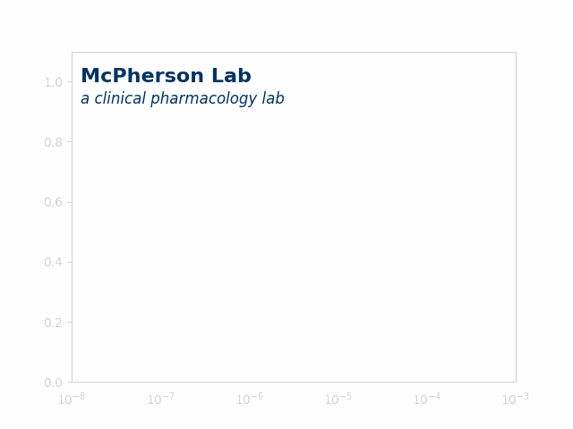

```{=html}
<div style="width:100%; display:flex; justify-content:center;">
  
</div>
```

## A Culture of Biomedical Science

We are a [**cloud native lab of pharmacists and pharmacologists**](https://github.com/McPhersonLab) exploring infectious diseases and drug development using open-science principles 🧬🌍

We share [**our works**](https://mcphersonlab.github.io/publications/) at [**conferences**](https://mcphersonlab.github.io/research/#conference-map-and-calendar) 📃
<!-- - [**Gallery**](https://jacobkmcpherson.com/gallery) 🎥📸 -->
<!-- - [**Blog**](https://jacobkmcpherson.com/blog) ✍🏻📚 -->
<!-- This is a silent comment in markdown. It won't appear in output. -->
<!-- ## Lab Environment -->
<!-- Our group fosters a collaborative and inclusive environment where researchers at all levels can thrive and contribute to meaningful scientific discoveries. -->
<!-- ## Location -->
<!-- [University/Institution Name]  -->
<!-- [Department]  -->
<!-- [Address] -->
& stay updated via [**podcasts**](https://mcphersonlab.github.io/podcasts/) 🎙️🔉
<!-- - [**Science**](https://jacobkmcpherson.com/science) 🔬 -->
<!-- - [**Medicine**](https://jacobkmcpherson.com/medicine) ⚕️ -->
<!-- - [**Pharmacy**](https://jacobkmcpherson.com/pharmacy) 💊 -->
<!-- - [**Infectious Diseases**](https://jacobkmcpherson.com/infectious-diseases) 🦠 -->

```{=html}
<div class="page-navigation">
  <div></div>
  <div>
    <a href="about/index.html" class="btn btn-outline-primary">About <i class="bi bi-arrow-right"></i></a>
  </div>
</div>
```
